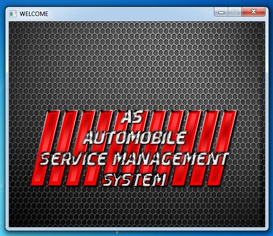
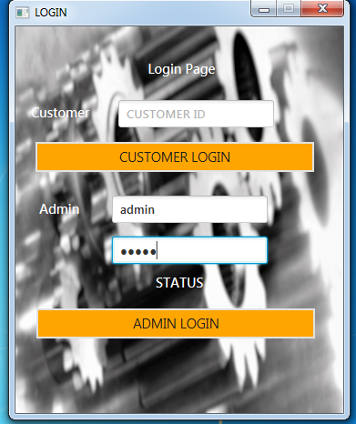
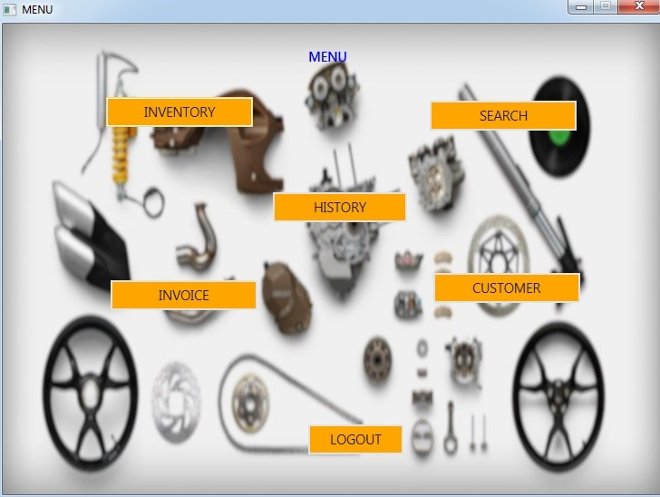

---

### Aim:

---

> To develop an automobile service management system using JavaFX. This management system can be implemented by service station to ease out their workflow and to maintain and manage their inventory and customers at a single point of contact.

---

### Description of Project:

---

> The Automobile Service Management System stores all the information of the parts of automobile in the inventory. The inventory can be used to add, update and delete parts from the inventory.
It also maintains their day to day transactions of stocks manually. The inventory consists of multiple types of products. Inventory makes it easy to keep a track of all parts, to check the stock, quantity and price of products. Based on the part id or part name, specific part can be fetched from the inventory.

> The Automobile Service Management System generates invoice of all the customers who did repair and service at the service station. It keeps a track of invoice of all the customers. The invoice will be generated on basis of parts required for servicing of vehicle of a customer. Total bill amount will be calculated based in the quantity and parts needed for repair and servicing.

> Various customers can be added to the database of the automobile service station database, if the customer has visited the service and repair station. Data of the customers can be updated, deleted. As well as a new customer can be added to the database of the automobile service management system.
The customer can also view his servicing history and estimated pick up date of the vehicle.

> Our software takes care of all the above functionalities. Along with it, it keeps a log of stock in the inventory as well as keeps track of purchases made.
The software is provided with the master entries  to enter a new part in the inventory , update and delete the same. It also allows us to add a new customer, update and delete the record from the database.

---

### Project Scope: 

---

> As this is a generic software it can be used by a wide variety of outlets to automate the process of manually maintaining the inventory records related to subject of maintaining the stock.
The main goal of the application is to maintain the records of purchased parts and customer log.
The application will cover the functionalities like add parts to the inventory, updating and deleting, search parts from the same. It will also generate invoice of various customers who visited and did repair and service at the automobile service station. Customers can be added to the database of the service station, customer information can be updated as well as a customer can be deleted from the database. Customer can view history of his servicing as well as can find out his estimated pick up date of the vehicle after servicing.

## This application can be accessed by two different kinds of users

* Administrator (Admin)
* Customer

## Administrator has a control over:

* Inventory: Add Delete Update Search parts and respective information
* Customer: Add Delete Update customer from the database of the service station
* Invoice: Generate invoice of the customer who did repair and service, and to calculate total bill amount based on the parts purchased
* History: The admin can view history of the customers who visited the service station

---

### Welcome Page

---

---

### Login Page

---

---

### Main Menu

---

---

### Please View the Video for complete Project description

> https://github.com/pisalsaurabh/JavaProject/blob/master/AS_Automobile%20Service%20Management%20System%202017-12-02_19-49-44.mp4

---

## Licence and Copy Right

* ©Saurabh shekhar pisal - All rights reserved

